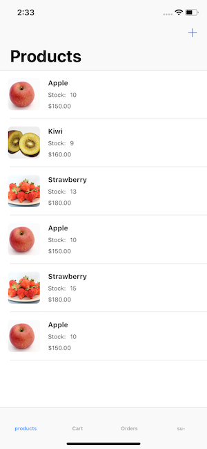
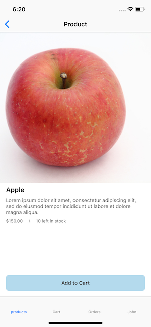
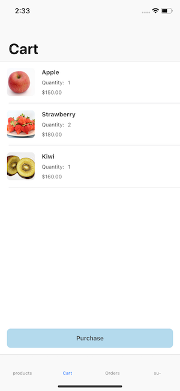
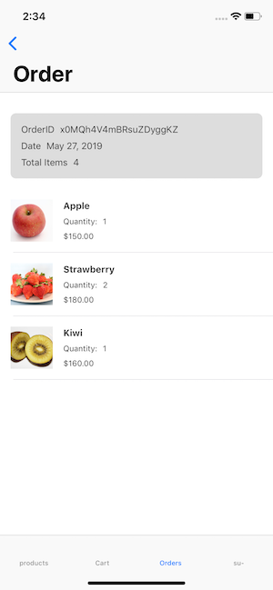

# Shopping-Cart

Example Application Using Firebase

|  |  |
| --------------------- | --------------------- |
|  |  |

## iOS

### Setup

- Download the latest config file `GoogleService-Info.plist` from Firebase Project console.
- Move `iOS` directory and execute these commands.

```bash
$ cd iOS/
$ bundle install
$ bundle exec pod install
$ mv GoogleService-Info.plist Shopping-Cart/
```

- Launch workspace and build.

## Backend

### Setup

- Download the latest config file `admin_sdk.json` from Firebase Project console. (See: https://console.firebase.google.com/project/<your-project-id>/settings/serviceaccounts/adminsdk)
- Move `Firebase` directory and execute these commands.

```bash
# Install yarn if you have not installed yet.
$ npm install -g yarn
$ cd Firebase/
$ yarn install

# Build functions
$ yarn build

# Deploy functions and firestore.rules
$ yarn firebase deploy
```
